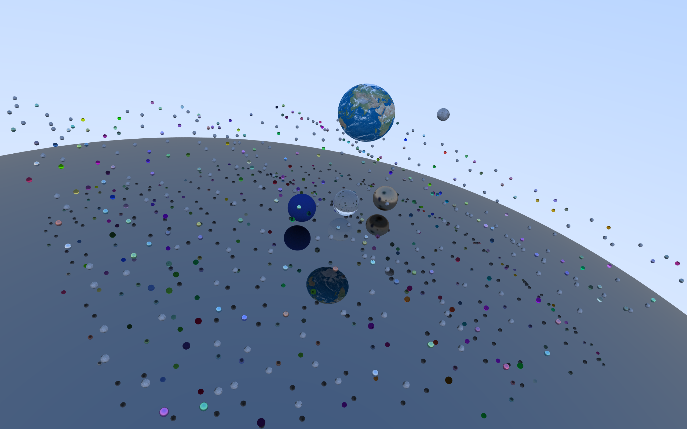
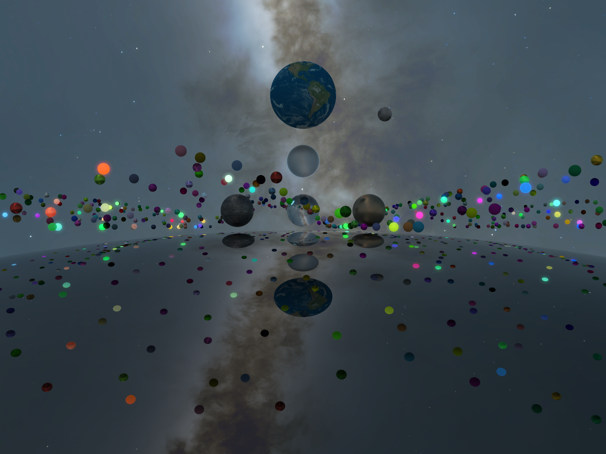
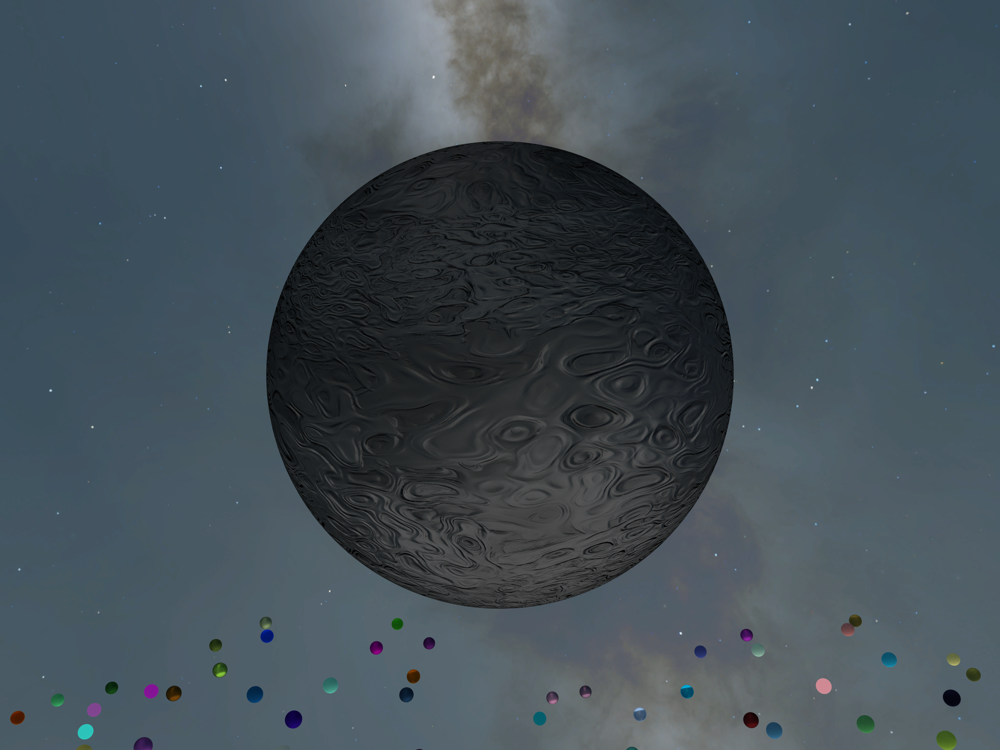

# DirectX Raytracing Spheres Demo

Real-time physically based rendering using GPU capable of DirectX Raytracing.







https://user-images.githubusercontent.com/39995363/150128189-1301be4b-1961-446c-98f5-4541a75a80b9.mp4

https://user-images.githubusercontent.com/39995363/219614024-f2b1b53f-d738-4d6c-b127-78f538b594cf.mp4

---

## Features
### PBR Metallic/Roughness Workflow

### Rigid-Body Simulation Using NVIDIA PhysX

### Graphics Settings
- Window Mode: Windowed | Borderless | Fullscreen
- Resolution
- HDR
- V-Sync
- NVIDIA Reflex
- Camera
	- Jitter
	- Horizontal Field of View
- Raytracing
	- Russian Roulette
	- Bounces
	- Samples/Pixel
- NVIDIA Shader Execution Reordering
	- NVIDIA RTX Dynamic Illumination
		- ReSTIR DI
			- ReGIR
				- Cell Size
				- Cell Visualization
			- Initial Sampling
				- Local Light
					- Mode: Uniform | Power RIS | ReGIR RIS
					- Samples
				- BRDF Samples
	- NVIDIA RTX Global Illumination
		- Spatially Hashed Radiance Cache
			- Downscale Factor
			- Scene Scale
			- Roughness Threshold
			- Hash Grid Visualization
- Post-Processing
	- NVIDIA Real-Time Denoisers
		- Denoiser: ReBLUR | ReLAX
		- Validation Overlay
	- Super Resolution: NVIDIA DLSS | Intel XeSS
	- Frame Generation: NVIDIA DLSS
	- NVIDIA Image Scaling
		- Sharpness
	- Chromatic Aberration
	- Bloom
		- Strength
	- Tone Mapping
		- HDR
			- Paper White Nits
			- Color Rotation: Rec.709 to Rec.2020 | DCI-P3-D65 to Rec.2020 | Rec.709 to DCI-P3-D65
		- Non-HDR
			- Operator: Saturate | Reinhard | ACES Filmic
			- Exposure

### Supported Input Devices
- Xbox Controller
- Keyboard
- Mouse

---

## Minimum Build Requirements
### Development Tools
- Microsoft Visual Studio 2022 (17.4)

- CMake (3.28)

- Git with LFS

- vcpkg
	```powershell
	> git clone https://github.com/Microsoft/vcpkg
	> cd vcpkg
	> .\bootstrap-vcpkg.bat
	> [Environment]::SetEnvironmentVariable("VCPKG_ROOT", $PWD.Path, [EnvironmentVariableTarget]::User)
	```

### Dependencies
- Git Submodule
	```powershell
	> git submodule update --init --recursive
	```

- Windows 11 SDK (10.0.22621.0)

## Minimum System Requirements
- OS: Microsoft Windows 10 64-bit, version 2004
- Graphics:
	- Basic: Any GPU capable of DirectX Raytracing Tier 1.1
	- NVIDIA
		- Shader Execution Reordering: GeForce RTX 40 Series
		- DLSS
			- Super Resolution: GeForce RTX 20 Series
			- Frame Generation: GeForce RTX 40 Series
