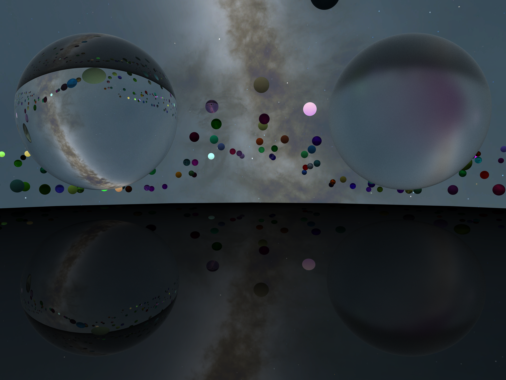

# DirectX Raytracing Spheres Demo

Real-time physically based rendering using GPUs capable of DirectX Raytracing, plus physics simulation using NVIDIA PhysX.




https://user-images.githubusercontent.com/39995363/150128189-1301be4b-1961-446c-98f5-4541a75a80b9.mp4

https://user-images.githubusercontent.com/39995363/182796109-f6d74781-0917-4c1d-8277-692bdc43d389.mp4

---

## Features
### Supported Physically Based Material Attributes and Texture Map Types
- Base Color
- Emissive Color
- Specular
- Metallic
- Roughness
- Opacity

#### Other Material Attributes
- Refractive Index

#### Other Texture Map Types
- Ambient Occlusion
- Normal
- (Environment) Cube

### Graphics Settings
- Window Mode: Windowed | Borderless | Fullscreen
- Resolution
- V-Sync
- Camera
	- Vertical Field of View
- Raytracing
	- Max Trace Recursion Depth
	- Samples Per Pixel
- Temporal Anti-Aliasing
	- Alpha
	- Color-Box Sigma

### Controls
- Xbox Controller
	|||
	|-|-|
	|Menu|Open/close menu|
	|View|Run/pause physics simulation|
	|LS (rotate)|Move|
	|LT (hold)|Move slower|
	|RT (hold)|Move faster|
	|RS (rotate)|Look around|
	|X|Toggle gravity of Earth|
	|B|Toggle gravity of the star|

- Keyboard
	|||
	|-|-|
	|Alt + Enter|Toggle between windowed/borderless and fullscreen modes|
	|Esc|Open/close menu|
	|Tab|Run/pause physics simulation|
	|W A S D|Move|
	|Left Ctrl (hold)|Move slower|
	|Left Shift (hold)|Move faster|
	|G|Toggle gravity of Earth|
	|H|Toggle gravity of the star|

- Mouse
	|||
	|-|-|
	|(Move)|Look around|

---

## Minimum Build Requirements
### Development Tools
- Microsoft Visual Studio 2022 (17.4)

- vcpkg
	```cmd
	> git clone https://github.com/Microsoft/vcpkg
	> cd vcpkg
	> .\bootstrap-vcpkg.bat
	> .\vcpkg integrate install
	```

### Dependencies
- Windows 11 SDK (10.0.22621.0)

- [DirectX Tool Kit for DirectX 12](https://github.com/Microsoft/DirectXTK12)
	```cmd
	> .\vcpkg install directxtk12:x64-windows
	```

- [PhysX](https://github.com/NVIDIAGameWorks/PhysX)
	```cmd
	> .\vcpkg install physx:x64-windows
	```

- [Dear ImGui](https://github.com/ocornut/imgui)
	```cmd
	> .\vcpkg install imgui[core,dx12-binding,win32-binding]:x64-windows
	```

- [JSON for Modern C++](https://github.com/nlohmann/json)
	```cmd
	> .\vcpkg install nlohmann-json:x64-windows
	```

## Minimum System Requirements
- OS: Microsoft Windows 10 64-bit, version 2004
- Graphics: Any GPU supporting DirectX Raytracing Tier 1.1
	- NVIDIA GeForce RTX Series
	- AMD Radeon RX 6000 Series
