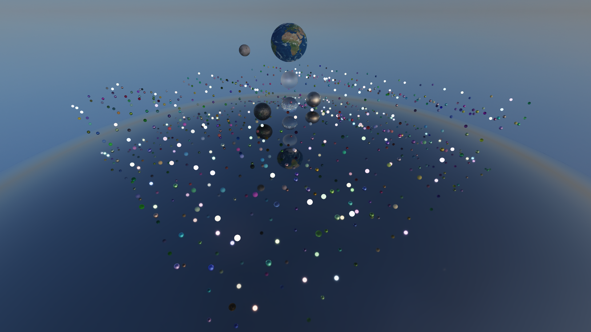

# DirectX Raytracing Spheres Demo

Real-time rendering using DirectX Raytracing with compatible GPUs and physics simulation using NVIDIA PhysX.



https://user-images.githubusercontent.com/39995363/150128189-1301be4b-1961-446c-98f5-4541a75a80b9.mp4

https://user-images.githubusercontent.com/39995363/153931319-bfc44214-216b-4560-8dd2-16e64f503ce2.mp4

---

## Features
### Graphics Settings
- Window Mode
- Resolution
- Raytracing Samples Per Pixel

### Controls
- Xbox Controller
	|||
	|-|-|
	|Menu|Open/close menu|
	|View|Pause/resume|
	|LS (rotate)|Move|
	|LT (hold)|Move slower|
	|RT (hold)|Move faster|
	|RS (rotate)|Look around|
	|X|Toggle gravity of Earth|
	|B|Toggle gravity of the star|

- Keyboard
	|||
	|-|-|
	|Alt + Enter|Toggle between windowed/borderless and fullscreen modes|
	|Esc|Open/close menu|
	|Tab|Pause/resume|
	|W A S D|Move|
	|Left Ctrl (hold)|Move slower|
	|Left Shift (hold)|Move faster|
	|G|Toggle gravity of Earth|
	|H|Toggle gravity of the star|

- Mouse
	|||
	|-|-|
	|(Move)|Look around|

---

## Minimum Build Requirements
### Development Tools
- Microsoft Visual Studio 2022

- vcpkg
	```cmd
	> git clone https://github.com/Microsoft/vcpkg
	> cd vcpkg
	> .\bootstrap-vcpkg.bat
	> .\vcpkg integrate install
	```

### Dependencies
- [DirectXTK12](https://github.com/Microsoft/DirectXTK12)

- [PhysX](https://github.com/NVIDIAGameWorks/PhysX)
	```cmd
	> .\vcpkg install physx:x64-windows
	```

- [Dear ImGui](https://github.com/ocornut/imgui)
	```cmd
	> .\vcpkg install imgui[core,win32-binding,dx12-binding]:x64-windows
	```

## Minimum System Requirements
- OS: Microsoft Windows 10 64-bit, version 1809
- Graphics
	- NVIDIA GeForce GTX 1060 with 6 GB VRAM
	- NVIDIA GeForce GTX 1660
	- AMD Radeon RX 6000 Series
